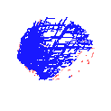

# Starlink PHP Client

[](https://packagist.org/packages/srwiez/starlink-client)
[](https://packagist.org/packages/srwiez/starlink-client)
[](https://packagist.org/packages/srwiez/starlink-client)
[](https://packagist.org/packages/srwiez/starlink-client)
[](https://github.com/srwiez/php-starlink-client/actions/workflows/test.yml)

PHP client to monitor and control your Starlink dish via the local gRPC API. 

This client uses the gRPC API of your Starlink device. API classes are generated based on the protoset file extracted from the reflection service of the Starlink device. 

This client is not affiliated with SpaceX or Starlink.

It also comes with an obstruction map generator to visualize the obstruction map of the dish.




## 🚀 Installation
This package can be installed via composer, be aware that you need to have the `grpc` extension installed on your system.
```bash
composer require srwiez/starlink-client
```

## 📚 Usage
You can use the `SRWieZ\StarlinkClient\Dishy` class to interact with your Starlink device.

### Getting the status
Get all the information about the device.
```php 
use SRWieZ\StarlinkClient\Dishy;

$dishy = new Dishy('192.168.100.1:9200');
$infos = $dishy->getStatus();
```

Get the sleep/powersave configuration
```php
$sleepConfig = $dishy->getSleepModeConfig();
```

Get history of the following statistics:
- Ping drop rate
- Ping Latency
- Download speed
- Upload speed
- Power usage

```php
$statistics = $dishy->getStatsHistory();
```

If enabled in the settings of the mobile app, you can get the location of the dish.
```php
$location = $dishy->getLocation();
```

### Generate the obstruction map
You can obtain the obstruction map of the dish. For more information about the representation of each pixel in the data, refer to [this link](https://github.com/sparky8512/starlink-grpc-tools/blob/main/dish_obstruction_map.py).
```php
use SRWieZ\StarlinkClient\Dishy;

$dishy = new Dishy('192.168.100.1:9200');

// Get the obstruction map
$data = $dishy->getObstructionMap();

// Colored image
(new ObstructionMapGenerator($data))
    ->transparent()
    ->generate()
    ->asFile('assets/obstruction_map.png');

(new ObstructionMapGenerator($data))
    ->transparent(false)
    ->grayscale()
    ->opacity(0.95)
    ->generate()
    ->asFile('assets/obstruction_map_grayscale.png');
```
See result in the [assets](assets) folder or the images above.

### Send a command
Using the local gRPC API, you can send a limited set of commands to the user terminal. These commands are all listed below. 

```php
use SRWieZ\StarlinkClient\Dishy;

$dishy = new Dishy('192.168.100.1:9200');

// Reboot the dish
$dishy->reboot();

// Stow the dish
$dishy->stow();

// Unstow the dish
$dishy->unstow();

// Reset obstruction map
$dishy->resetObstructionMap();

// Enable power save mode
$dishy->setSleepModeConfig(
    start: 60, // 01:00
    duration: 120, // 03:00
);

// Disable power save mode
$dishy->disableSleepMode();
```

### Advanced usage
If you prefer to use the gRPC client directly, you can use the generated `DeviceClient` class.

```php
use SpaceX\API\Device\DeviceClient;
use Grpc\ChannelCredentials;
use SpaceX\API\Device\GetStatusRequest;

$client = new DeviceClient('192.168.100.1:9200', [
    'credentials' => ChannelCredentials::createInsecure(),
]);

[$response, $status] = $client->Handle(
    new Request(['get_status' => new GetStatusRequest()])
)->wait();
```

## 📋 TODO
Contributions are welcome!

- Finish CLI tool / examples
- Add more tests
- Create a script to generate proper enums and parse the values in the response to return those enums.
- Implement the authentication web API used by the mobile app to gain more control over the dish (e.g., snow melt mode, etc.).

## 🧑‍🔧 Building the client
If you have a starlink in your local network, you can update the client by running the following command.

Before running the command, make sure you have the `grpcurl`,  `protoc` and `grpc_php_plugin` installed on your system.

```bash
./update_client.sh
```

## 🤝 Contributing
Clone the project and run `composer update` to install the dependencies.

Before pushing your changes, run `composer qa`. 

This will run [pint](http://github.com/laravel/pint) (code style), [phpstan](http://github.com/phpstan/phpstan) (static analysis), and [pest](http://github.com/pestphp/pest) (tests).

Additionally, if you have a Starlink dish on your local network, you can update the gRPC client by running `./update_client.sh`. This command will update everything under the `SpaceX` namespace. After that, run `composer qa` to ensure everything is still functioning properly. If everything is fine and new functionality has been published by the gRPC reflection service, you can submit a pull request for your changes.


## 👥 Credits

Starlink PHP Client was created by Eser DENIZ.

The following projects inspired this library and served as a reference:

- https://github.com/ewilken/starlink-rs
- https://github.com/sparky8512/starlink-grpc-tools
- https://github.com/fullstorydev/grpcurl

## 📝 License

Starlink PHP Client is licensed under the MIT License. See LICENSE for more information.
